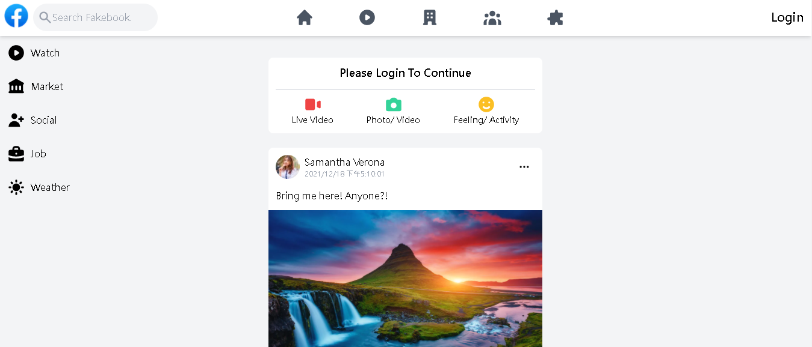
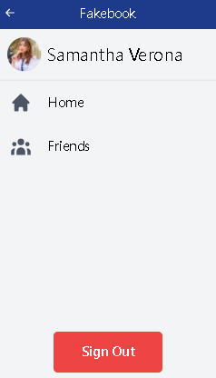
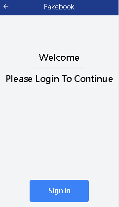
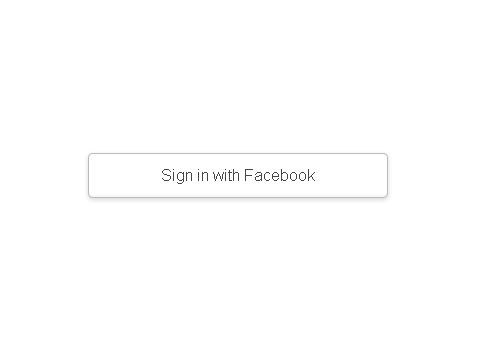
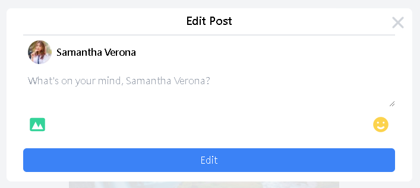
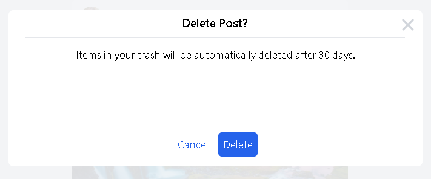

# Fakebook

A Facebook clone side project build with Next.js + Tailwind CSS + Firebase + NextAuth.js

## Description

Fakebook will first check if the user is login or not inside the Next.js getServersideProps feature by using NextAuth.js getSession function. If you are not signed in, you will see the 'please login to continue' message. At this moment, you are unable to add, edit and delete post.

Click the Login button on the top left corner of home page to login. Session will return as props on the home page, then update the redux's user state through useEffect hook, so Next.js will know what to show depend on the existence of session.

## RWD in phone mode

Not only for website, Fakebook is also available on mobile mode with the RWD. The following login process description will proceed in phone mode

> 

Click on the hamburger icon and menu will show up:

> > 

If you haven't signed in, the menu will show up as:

> > 

Click the sign in button, login page then come into play

> > > 

Finally we have reached the NextAuth.js default login page, sign in with your facebook account, then you can start posting on Fakebook

> > > > 

You can post some words with or without picture

Then you can see the latest post appears immediately due to realtime firestore function

Changed your mind? Neither edit or delete it, all on you!
Click on the three dots icon, an option box will pop up

Editing post

Deleting post

That's it! I hope you like my side project!

## Thank you for your time
